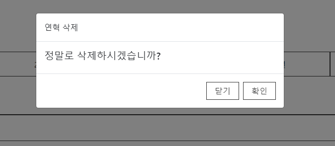
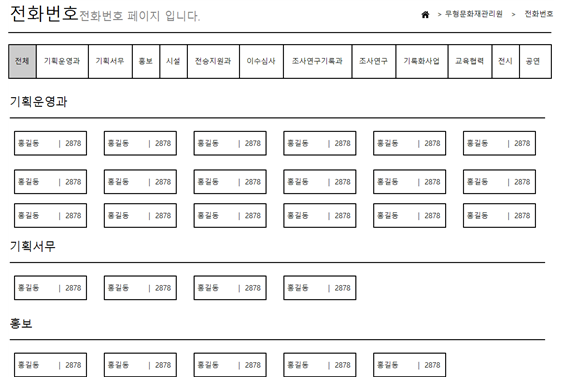
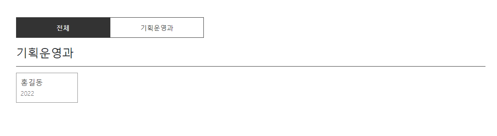
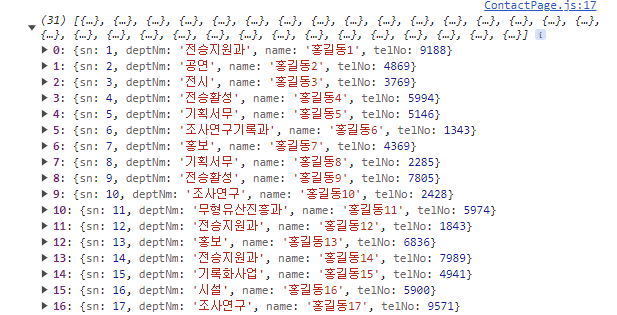
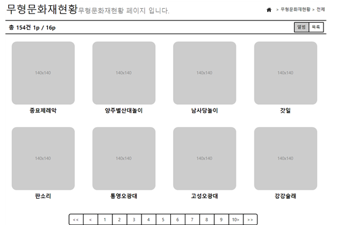
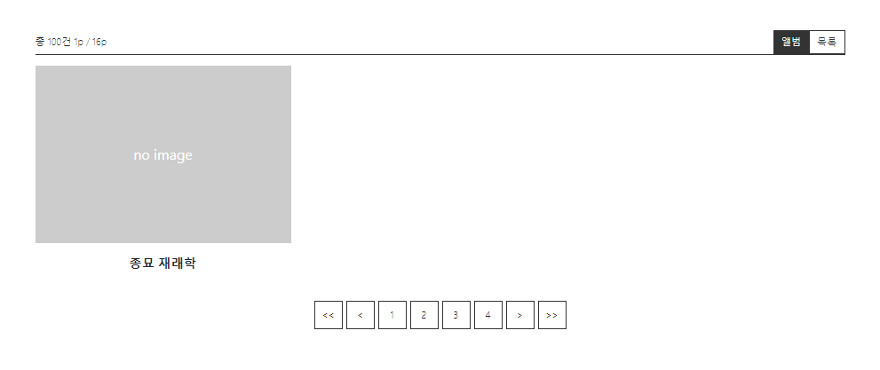
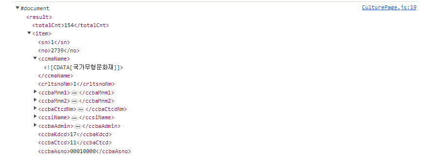
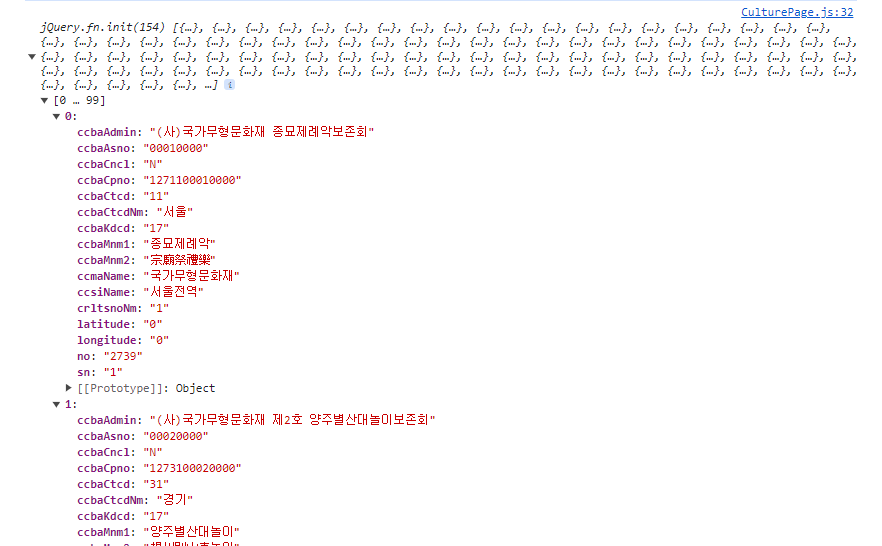
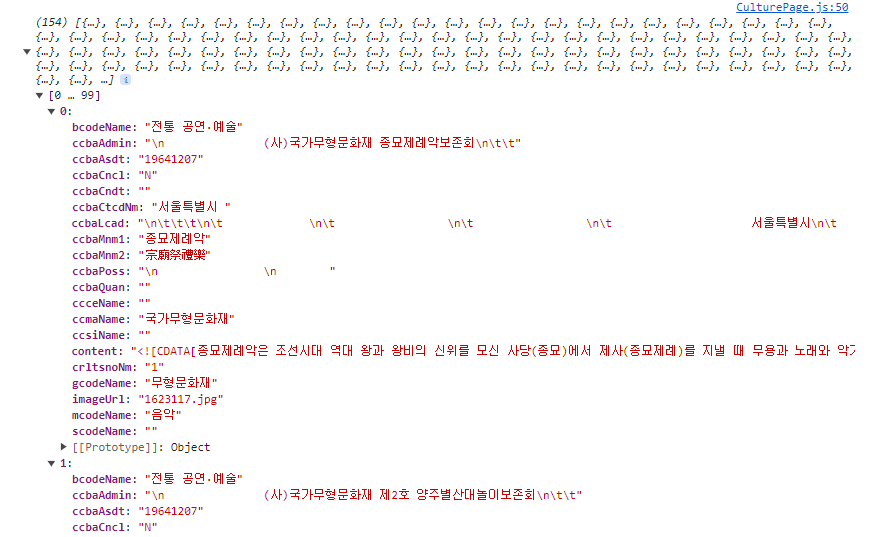
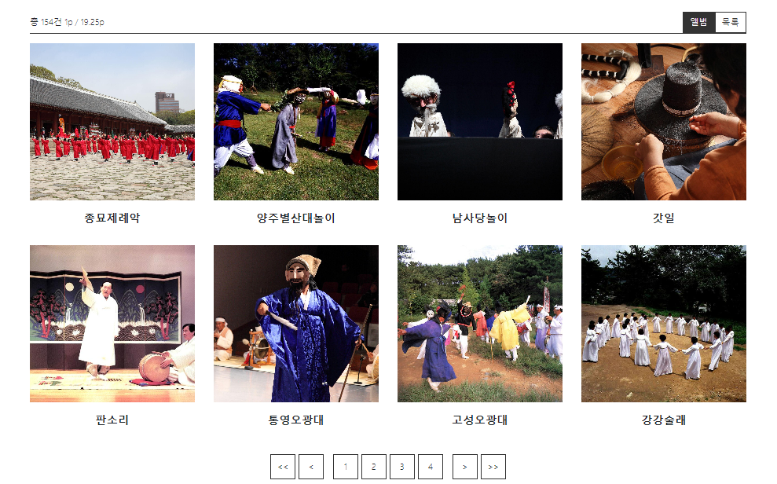

# Javascript Class Guide

---

## 개요

해당 글은 기능경기대회에서 Javascript 과제를 수월하게 해결하기 위한 방법을 이야기 한다.
기능경기대회에서 주요시 되는 JS 능력은 기본적으로 과제를 해결하는 문제해결능력도 중요하지만
B과제 기준 3시간 내에 프론트엔드에서 요구하는 기능을 모두 구현해야하기 때문에
시간적으로 촉박함을 안고 간다는 것에 있다. 따라서 B과제에 필요한 Javascript 능력은 다음과 같다.

1. 최대한 코드를 간단명료하게 작성할 것
2. 코드를 기억하기 쉽게 작성할 것
3. 전체적인 맥락을 정할 것

이를 전체적으로 충족하기 위해서 문제에서 제시한 내용을 객체화하고 class 로 코드를 구성하는 편이 좋다.
class 로 각 요소를 구체화하면 각 class 가 가져야할 동작이나 상태가 생겨나고, 단순한 코드 덩어리가 아니라
하나의 객체로 인식할 수 있게 되어 코드 전체가 기억하기 쉬워지며, 맥락이 생겨나기 때문이다.

따라서 해당 글에서는 2021년 지방기능경기대회 문제를 참고하여 B과제를 class 로 해결하는 방법에 대해 설명한다.

## 연혁 및 연혁 관리

2021년 지방대회 과제는 xampp 를 기반으로 서버에서 구동되어 미리 제공되는 php API 파일을 활용해 코드를 구성해야 한다.
해당 B과제에서 xampp 자체에는 별 다른 설정을 하지 않기 때문에 xampp 설치 및 실행과 관련된 이야기는 생략하도록 하겠다.


먼저, 연혁 및 연혁 관리 부분이다. 연혁을 등록하거나 수정 및 삭제할 수 있으며, 브라우저 내에 Storage 기능을 통해
브라우저가 닫혀도 기존에 등록한 내용이 모두 유지되어야 한다. 연혁의 등록과 수정은 모달창을 통해 이루어져야 하며, 삭제는
Confirm 창을 직접 만들어서 삭제 여부를 다시 물어보아야 한다.

```html
<div class="history">
  <div class="header">
    <button class="add">연혁 등록</button>
  </div>
  <div class="tab">
    <div class="tab__item">2019년</div>
    <div class="tab__item">2020년</div>
    <div class="tab__item">2021년</div>
    <div class="tab__item">2022년</div>
    <div class="tab__item">2023년</div>
  </div>
  <div class="content">
    <div>
      <h3>2023년</h3>
      <div class="history-list">
        <div class="history-list__item">
          <div class="date">01. 19.</div>
          <div class="title">부산 해외취업지원센터 일학습과정개발센터 신설</div>
          <div class="button-wrap">
            <button class="btn-edit">수정</button>
            <button class="btn-remove">삭제</button>
          </div>
        </div>
      </div>
    </div>
  </div>
</div>
```

```css
* {
  margin: 0;
  padding: 0;
  box-sizing: border-box;
}

.button-wrap {
  display: flex;
  gap: 5px;
}

button {
  padding: 0.3em 1em;
  border: 1px solid #333;
  color: #333;
  background-color: #fff;
  font-size: 14px;
  cursor: pointer;
}

.history {
  max-width: 1140px;
  margin: 50px auto;
}

.history .header {
  display: flex;
  justify-content: flex-end;
  margin-bottom: 20px;
}

.tab {
  display: flex;
  flex-wrap: wrap;
}

.tab__item {
  flex: 0 0 20%;
  max-width: 20%;
  width: 100%;
  height: 50px;
  border: 1px solid #333;
  background-color: #fff;
  color: #333;
  text-align: center;
  line-height: 50px;
  cursor: pointer;
}

.tab__item.selected {
  background-color: #333;
  color: #fff;
}

.history .content {
  margin-top: 20px;
}

.history h3 {
  font-size: 30px;
  margin-bottom: 20px;
}

.history-list {
  border-top: 2px solid #333;
}

.history-list__item {
  padding: 0.5em;
  display: flex;
  align-items: center;
  border-bottom: 1px solid #333;
}

.history-list .date {
  flex: 0 0 80px;
  text-align: center;
}

.history-list .title {
  flex: 1 0 0;
  overflow: hidden;
  text-overflow: ellipsis;
  white-space: nowrap;
}

.history-list .button-group {
  flex: 0 0 150px;
}
```

간단하게 HTML 및 CSS 파일을 구성한다. 위 코드를 적용하면 다음과 같은 화면을 얻을 수 있다.


이제 저 화면을 하나의 객체로 만들어 보자. 해당 페이지가 지니고 있어야 하는 것은 무엇일까? 해당 과제에서 페이지로 저장되어야 하는 요소는 다음과 같다.

- 연혁 목록
- 현재 선택한 연도

그럼 이를 class 로 만들어 보면 다음과 같이 만들 수 있다.

```javascript
// HistoryPage.js

class HistoryPage {
  historyList = [];
  selectedYear = null;
}
```

여기서 우리는 저장된 historyList 를 바탕으로 .tab과 .history-list에 DOM을 직접 조작해서 historyList 에 있는 연도를 사용해 각 탭을 그려주어야 하고, 제목과 날짜를 사용해 history-list 내에 있는 내용물을 채워주어야 한다.

이들을 감싸는 wrap Element 에 접근하기 위해 변수를 마련해준다.

```javascript
class HistoryPage {
  // ... (생략)

  listWrapElem = null;
  tabWrapElem = null;
}
```

이렇게 변수가 준비가 완료되었다면, DOM이 load 되면 실행될 초기세팅 메서드를 추가해 보자. 해당 코드는 document 가 ready 되면 실행되어 기본적인 DOM을 저장하고 데이터를 세팅해 주는 역할을 할 것이다.

```javascript
class HistoryPage {
  // ...

  init() {
    this.listWrapElem = $('.history-list')[0];
    this.tabWrapElem = $('.tab')[0];

  }
}

$(window).on('load', () => {
  const app = new HistoryPage();
  app.init();
});
```

jQuery 를 사용하면 기존에 Javascript에서 제공하는 DOM 객체가 아니라, jQuery 로 한번 감싼 jQuery 객체가 되기 때문에 기본적으로 제공되는 DOM 기능을 원활하게 사용하기 어려울 수 있다. 하지만, `document.querySelector`보단 `$`가, `addEventListener`보단 `on` 이 좀 더 빠르게 코드를 작성할 수 있기 때문에 이를 이용해서 데이터에 접근한다.

이제 기본적인 환경은 구성되었으니, 필요한 내용을 구상해보자.

### 연혁 추가

우선, 데이터가 있어야 보여줄 수 있는 데이터가 생기기 때문에, 연혁 추가와 관련된 작업을 선행해 보겠다. 연혁 추가의 경우 모달 다이얼로그를 추가적으로 생성해서 제작한다. 여기서 문제는 모달을 어떻게 만들 것인가인데, 가장 간단한 방법은 Bootstrap을 사용하는 방법이다.

물론, 모달을 만드는 것이 그렇게 어려운 것은 아니고 만들려면 만들 수는 있지만 최대한 기능경기대회에서는 시간을 단축하는 것이 목표이고, Bootstrap 은 웬만하면 무조건 제공되는 라이브러리이며, 단순히 HTML 에 class 및 data-target / toggle 만 지정해주면 되기 때문에 해당 방법을 채택하게 되었다.
먼저 bootstrap 을 연결해 준다. (2021년도 지방대회에서 제공된 4.5.0 버전을 사용한다.)

Bootstrap은 jQuery가 없으면 동작하지 않는 점을 유의하자.

```html
<head>
  <!-- ... -->
  <link rel="stylesheet" href="./assets/bootstrap-4.5.0-dist/css/bootstrap.min.css">
  <script src="./assets/jquery-3.5.1.js"></script>
  <script src="./assets/bootstrap-4.5.0-dist/js/bootstrap.min.js"></script>
</head>
```

그 뒤 HTML 맨 아래에 다음 코드를 추가해 준다.

```html
<form id="insert-form" class="modal fade">
  <div class="modal-dialog">
    <div class="modal-content">
      <div class="modal-header">
        <h4>연혁 등록</h4>
      </div>
      <div class="modal-body">
        <div class="form-group">
          <label>연혁내용</label>
          <input type="text" class="form-control title">
        </div>
        <div class="form-group">
          <label>연혁일자</label>
          <input type="date" class="form-control date">
        </div>
      </div>
      <div class="modal-footer">
        <button type="button" data-dismiss="modal">닫기</button>
        <button type="submit">등록하기</button>
      </div>
    </div>
  </div>
</form>
```

이렇게 모달에 id를 달아준 뒤, 다른 버튼에서 다음과 같이 속성을 지정해주면 클릭했을 때 자동으로 해당 모달이 열리게 된다.

```html
<button class="add" data-toggle="modal" data-target="#insert-form">연혁 등록</button>
```


Bootstrap 을 사용하면 사용할 일이 많은 input 이나 modal 을 쉽게 대체할 수 있기 때문에 관련된 클래스명만 기억해 두었다가 사용하면 손쉽게 B, C과제에서 디자인이 가능하다.

이제 Javascript 쪽에서 이를 활용해서 데이터를 삽입하는 로직을 만들어 보자.

```javascript
init() {
  // ...

  this.setEvent();
}

setEvent() {
  $("#insert-form").on("submit", (e) => {
    e.preventDefault();

    let title = e.target[0].value;
    let date = e.target[1].value;

    e.target[0].value = '';
    e.target[1].value = '';
    
    this.historyList.push({ title, date });

    $("#insert-form").modal("hide");
  });
}
```

Form Element는 자신한테 속한 input과 button을 인덱스로 저장하고 있기 때문에, 순차대로 0, 1로 접근해서 title 과 date를 가져와 historyList에 넣어준다. 이대로면 단순히 historyList 란 변수에다 데이터만 넣은 것이기 때문에, 넣은 데이터를 업데이트 시켜줄 수 있는 메서드를 하나 더 만들어 보겠다.

```javascript
class HistoryPage {
  // ...
  render() {
    // 초기화
    this.listWrapElem.innerHTML = ``;
    // 렌더링
    this.historyList.forEach(historyItem => {
      let date = new Date(historyItem.date);
      let dateText = `${String(date.getMonth() + 1).padStart('0', 2)}. ${String(date.getDate()).padStart('0', 2)}.`;
      let elem = $(`<div class="history-list__item">
        <div class="date">${dateText}</div>
        <div class="title">${historyItem.title}</div>
        <div class="button-wrap">
          <button class="btn-edit">수정</button>
          <button class="btn-remove">삭제</button>
        </div>
      </div>`)[0];
      this.listWrapElem.append(elem);

      $('#insert-form').modal('hide');
    });
  }
}
```

Wrap Element 를 비우고서 현재 저장된 historyList 를 Element 로 연결한다.
jQuery는 CSS Selector 뿐만 아니라 HTML Content 를 입력해도 해당 콘텐츠를 jQuery Object 로 만들어 줄 수 있다. jQuery의 인덱스 0번째는 해당 DOM Element 이기 때문에, 이렇게 접근하여 listWrapElem 에 Element 를 삽입해 준다. Bootstrap 은 jQuery 를 기반으로 하여 modal 메서드를 통해 modal을 닫을 수 있으므로, 해당 명령어를 통해 닫기까지 해주면 렌더링이 완료된다.

이후 setEvent로 다시 돌아와서 render 함수를 실행시켜주게끔 변경해주면 삽입 모달이 열린 뒤 데이터를 입력하면 저장 후 닫히는거까지 완료된다.

```javascript
setEvent() {
  $("#insert-form").on("submit", (e) => {
    // ...
    this.render();
  });
}
```

### Storage 저장

이제 Storage 를 이용해서 해당 데이터를 브라우저 내에 기록해 보자.
브라우저에서 사용할 수 있는 Storage 로는 Cookies, LocalStorage, IndexedDB가 존재하는데, 이 중 가장 편의성이 좋은 LocalStorage 를 통해 데이터를 저장해 보도록 하겠다.

```javascript
class HistoryPage {
  // ...
  save() {
    localStorage.setItem("historyList", JSON.stringify(this.historyList));
  }

  load() {
    let savedData = localStorage.getItem("historyList");
    if (!savedData) return;
    this.historyList = JSON.parse(savedData);
  }
}
```

간단하게 localStorage를 이용해서 save / load 메서드를 만들었다. localStorage 에는 Object/Array 형태의 데이터가 저장될 수 없기 때문에 JSON.stringify 를 이용해 JSON 문자열로 만들어 준 뒤 저장하고, 나중에 불러올 때엔 JSON.parse 로 데이터를 가져온다.

만든 메서드를 사용해 보도록 하자. setEvent 에서 데이터를 배열에 저장 후 저장까지 시키도록 하고, init 에서는 데이터를 불러온 후, render 함수를 호출해 주자.

```javascript
init() {
  // ...

  this.load();
  this.render();
}

setEvent() {
  $("#insert-form").on("submit", (e) => {
    // ...

    this.save();
  });
}
```

이렇게 하면 데이터가 정상적으로 저장되는 것을 확인할 수 있다.

### 연혁 수정

연혁을 수정하려면 방금 사용했던 연혁 등록 모달과 같은 Form 모달이 필요하다.

Form 모달의 경우 기존에 사용했던 모달을 복사해서 그대로 사용하도록 하자.
위에 있는 모달을 그대로 복사해서 id 만 변경해 준다.

```html
<!-- ... -->
<form id="update-form" class="modal fade">
  <div class="modal-dialog">
    <div class="modal-content">
      <div class="modal-header">
        <h4>연혁 수정</h4>
      </div>
      <div class="modal-body">
        <div class="form-group">
          <label>연혁내용</label>
          <input type="text" class="form-control title">
        </div>
        <div class="form-group">
          <label>연혁일자</label>
          <input type="date" class="form-control date">
        </div>
      </div>
      <div class="modal-footer">
        <button type="button" data-dismiss="modal">닫기</button>
        <button type="submit">등록하기</button>
      </div>
    </div>
  </div>
</form>
```

기존에 HTML 파일에 있던 history-list__item을 JS 쪽의 render 메서드 안으로 옮겼기 때문에, render 메서드 안에 있는 HTML String 을 수정해서 modal 과 연결 해 준다.

```javascript
render() {
  // ...
  let elem = $(`<div class="history-list__item">
    <div class="date">${dateText}</div>
    <div class="title">${historyItem.title}</div>
    <div class="button-wrap">
      <button class="btn-edit" data-target="#update-form" data-toggle="modal">수정</button>
      <button class="btn-remove">삭제</button>
    </div>
  </div>`)[0];
  // ...
}
```

이제 클릭해 보면 수정하기 모달이 열리게 될 것이다.

하지만, 수정 모달이라면 기존 데이터가 INPUT 에 뿌려지고, 수정 버튼을 클릭했을 때 정상적으로 데이터가 변경되어야만 할 것이다. 이를 위해서는 현재 어떤 데이터가 변경되려고 하는지 인덱스를 저장해야할 것이고, 해당 인덱스의 데이터를 기본 값으로 뿌려주어야 할 것이다.

다음과 같이 수정해 보자.

```javascript
class HistoryPage {
  // ...
  changedIdx = null; // 추가

  // ...
  render() {
    // 초기화
    this.listWrapElem.innerHTML = ``;
    // 렌더링
    this.historyList.forEach((historyItem, i) => { // i 추가
      // ...

      let elem = $(`<div class="history-list__item">
        <div class="date">${dateText}</div>
        <div class="title">${historyItem.title}</div>
        <div class="button-wrap">
          <button class="btn-edit" data-target="#update-form" data-toggle="modal">수정</button>
          <button class="btn-remove">삭제</button>
        </div>
      </div>`)[0];

      // 추가
      elem.querySelector('.btn-edit').addEventListener('click', () => {
        this.changedIdx = i;
        $('#update-form').modal('show');
        $('#update-form .title').val(historyItem.title);
        $('#update-form .date').val(historyItem.date);
      });

      // ...
    })
  }
}
```

이렇게하면 수정 버튼을 클릭하였을 때 기본 값까지 모달에 반영된다.
참고로 `querySelector`의 경우 document 뿐만 아니라 특정 Element 에서도 사용할 수 있어서, Element에서 사용하게 되면 전체 문서가 아니라 해당 Element 내부에서만 검색하기 때문에 지금처럼 document 내에 요소가 추가되기 전부터 DOM에 접근이 가능하다.
마지막으로 실제로 데이터가 변경될 수 있도록 setEvent 쪽에 코드를 추가한다.

```javascript
class HistoryPage {
  
  // ...
  setEvent() {
    // ...
    $("#update-form").on("submit", (e) => {
      e.preventDefault();

      let title = e.target[0].value;
      let date = e.target[1].value;
      this.historyList[this.changedIdx] = {
        title,
        date,
      };
      this.render();
      this.save();

      $("#update-form").modal("hide");
    });
  }

  // ...
}
```

수정버튼을 클릭했을 때 저장했던 changedIdx 를 바탕으로 데이터를 변경하는 로직을 추가적으로 넣는다. 이렇게 하면 데이터도 변경되고, 새로고침 시 정상적으로 데이터가 저장된 모습을 확인할 수 있다.

### 연혁 삭제

삭제버튼은 Confirm 창으로 정말 삭제할 것인지 물어보는 과정이 필요하다.
해당 과정을 위한 모달을 HTML 파일에 추가시켜보도록 하자.

```html
<div id="remove-confirm" class="modal fade">
    <div class="modal-dialog">
      <div class="modal-content">
        <div class="modal-header">연혁 삭제</div>
        <div class="modal-body">
          <h5>정말로 삭제하시겠습니까?</h5>
        </div>
        <div class="modal-footer">
          <button data-dismiss="modal">닫기</button>
          <button class="btn-confirm" data-dismiss="modal">확인</button>
        </div>
      </div>
    </div>
</div>

```

이러면 아까 전에 수정 모달을 띄웠던 것처럼 render 메서드 내에 있는 HTML String의 button 태그를 변경하였을 때, 해당 Confirm 모달을 띄워줄 수 있다.

```javascript
render() {
  // ...
  let elem = $(`<div class="history-list__item">
    <div class="date">${dateText}</div>
    <div class="title">${historyItem.title}</div>
    <div class="button-wrap">
      <button class="btn-edit" data-target="#update-form" data-toggle="modal">수정</button>
      <button class="btn-remove" data-target="#remove-confirm" data-toggle="modal">삭제</button>
    </div>
  </div>`)[0];
  // ...
}
```



여기까지 다 되었다면 그 다음엔 실제로 데이터를 삭제시키는 로직을 추가해야 한다.
먼저, 수정과 동일하게 삭제할 때에도 어떤 데이터를 삭제할 것인지 인덱스를 저장하고 있어야하고 데이터를 삭제하였을 때 LocalStorage 및 실제 DOM 에도 반영되어야 한다.
인덱스의 경우 연혁 수정에서 사용했던 changedIdx 를 그대로 사용해도 문제되진 않는다.
관련 코드를 setEvent와 render 쪽에서 수정해주도록 하자.

```javascript

// ...
setEvent() {
  // ...
  $('#remove-confirm .btn-confirm').on('click', () => {
    this.historyList.splice(this.changedIdx, 1);
  });
}

render() {
  // ...
  let elem = $("...");
  // ...
  elem.querySelector('.btn-remove').addEventListener('click', () => {
    this.changedIdx = i;
  });
}
```

이제 삭제 버튼을 누르면 Confirm 모달이 뜨고, 해당 모달에서 확인을 클릭하면 데이터가 삭제되어 새로고침 시에도 삭제된 데이터는 보여지지 않는다.

### 필터링

마지막은 탭을 눌렀을 때 나오는 필터링 작업이다. 이를 위해서는 먼저 탭 목록을 렌더링 중에 그려줄 필요가 있다. 탭 목록은 저장된 모든 목록의 연도가 탭으로 보여져야 하는데, 이를 위해 getter 를 사용해 목록을 표현해 볼 것이다.

```javascript
class HistoryPage {
  // ...
  get yearList() {
    return Array.from(
      new Set(this.historyList.map((v) => new Date(v.date).getFullYear()))
    );
  }
  // ...
}
```

위와 같이 사용하면 `this.yearList`를 사용해서 접근할 때, 해당 함수가 자동으로 실행되어 historyList의 year 값만 mapping 하여 반환해 준다. 이 때, 연도의 중복을 제거해주어야 하기 때문에, `Set` 객체를 활용하는데, `Set`은 인수로 들어온 배열을 사용해서 선언할 수 있으며, 내부에는 중복된 데이터가 들어가는 것을 허용하지 않기 때문에 한번 선언하는 과정에서 중복된 데이터가 모두 제거된다. 이를 `Array.from` 메서드를 통해 다시 배열로 만들어 주면 중복을 손쉽게 제거할 수 있다.

만든 yearList 를 활용하여 render 함수 내부에 다음과 같은 내용을 추가해 보자.

```javascript
render() {
  // ...
  // 초기화
  this.tabWrapElem.innerHTML = "";
  // 렌더링
  this.yearList.forEach((year) => {
    let elem = $(`
      <div 
        class="tab__item ${this.selectedYear === year ? "selected" : ""}"
      >
      ${year}년
      </div>
    `)[0];
    this.tabWrapElem.append(elem);
  });

  $('.content h3').text(this.selectedYear + '년');
}
```

이렇게 하면 지금까지 입력한 연혁 데이터에 따라 탭에 보여지는 목록 정보가 달라지게 될 것이다. 이제 각 탭을 클릭하였을 때 아까 맨 처음에 만들었던 selectedYear의 값을 변경시켜준다. 변경된 데이터는 `.content h3`에 나타날 수 있도록 수정해 주었다.

```javascript
// 렌더링
this.yearList.forEach((year) => {
  let elem = $(`
    <div 
      class="tab__item ${this.selectedYear === year ? "selected" : ""}"
    >
    ${year}
    </div>
  `)[0];

  // 추가
  this.tabWrapElem.addEventListener('click', () => {
    this.selectedYear = parseInt(e.target.innerText);
    this.render();
  });
  this.tabWrapElem.append(elem);
});
```

이러면 클릭했을 때 selectedYear 값에 year 값이 들어가게 될 것이고, render 메서드를 실행시켜 다시 그려줌으로써 해당 연도에 해당하는 tab__item에게 selected 클래스가 부여될 것이다.

이제 해당 탭이 활성화되면 그 탭에 해당하는 연도의 데이터만 보여주어야 한다.

```javascript
render() {
  // 초기화
  this.listWrapElem.innerHTML = ``;
  // 렌더링 (수정)
  this.historyList
    .filter((item) => this.selectedYear === new Date(item.date).getFullYear())
    .forEach((historyItem, i) => {
      // ...
    }); 
}
```

렌더링 시마다 필터링을 걸어서 selectedYear 와 동일한 년도인 경우만 렌더링하도록 수정한다. 이러면 render 메서드가 실행될 때 항상 historyList 에서 selectedYear 를 활용한 필터링 과정을 무조건 거치기 때문에 데이터가 항상 선택한 연도에서만 보여지게 된다.

이제 마지막으로 selectedYear 자체도 항상 저장되어야하는 값이기 때문에, save / load 에 해당 값도 같이 저장되도록 변경하고, selectedYear 가 변경될 때도 save 메서드가 실행되게끔 추가해 준다.

```javascript
render() {
  // ...

  // 렌더링
  this.yearList.forEach((year) => {
    // ...

    this.tabWrapElem.addEventListener('click', (e) => {
      this.selectedYear = parseInt(e.target.innerText);
      this.render();
      this.save(); // 추가
    });
  });
}

save() {
  localStorage.setItem("historyList", JSON.stringify(this.historyList));
  localStorage.setItem("selectedYear", this.selectedYear); // 추가
}

load() {
  let savedData = localStorage.getItem("historyList");
  if (!savedData) return;
  this.historyList = JSON.parse(savedData);
  this.selectedYear = parseInt(localStorage.getItem('selectedYear')); // 추가
}
```

render 에서 각 tab을 렌더링을 할 때, 클릭 이벤트 내에 save 메서드를 같이 호출하면서 탭이 변경될 때마다 save 메서드가 호출되고, save 메서드 내에서 selectedYear를 localStorage에 같이 저장하면서 load 시 selectedYear 가 같이 불러오게끔 수정하였다.
이를 통해 처음 로딩 시 마지막으로 선택한 탭의 상태가 그대로 유지될 수 있게 되었다.

### 되돌아보기

여기까지 간단하게 연혁관리 페이지의 기능들을 구현하여 보았다.

기능만 놓고 따져보았을 때엔, 간단하게 글 추가, 수정, 삭제가 포함되어 있고 약간의 Storage 기능이 덧붙여진 담백한 과제이지만 이런 과제를 대회에서 사용하기 위해 코딩하게 된다면 조금 생각해보아야 할 요소들이 생겨난다. 대회는 기억력과 속도가 매우 중요하기 때문이다.

대부분의 B과제는 DOM 요소를 직접적으로 조작하고, DOM 요소 내에 이벤트를 걸어서 특정 동작을 수행하게 한다. 이번에 코드로 구성한 render / setEvent 메서드는 대부분의 B과제 문제에서 유효하다. 실행될 때마다 각 DOM의 요소를 다시 그리고, 다시 그릴 때마다 필요한 변경사항이 있으면 적용할 수 있기 때문이다.

그리고 이와 같은 요소들은 나중에 프론트엔드를 깊게 파고들 때 React 나 Vue와 같은 프론트엔드 프레임워크를 이해하는데 도움을 줄 수 있다. React와 같은 프레임워크 자체가 이러한 상태가 변화하면서 생겨나는 DOM에 대한 업데이트(render)를 좀 더 쉽고 간편하게 대처하기 위해 생겨났기 때문이다.

## 전화번호 목록



이제 이어서 전화번호 목록 쪽을 진행해 보도록 하자.
간단하게 과제에서 주어진 와이어프레임에 따라서 HTML/CSS 파일을 구성해 보겠다.

```html
<!DOCTYPE html>
<html lang="ko">

<head>
  <meta charset="UTF-8">
  <meta name="viewport" content="width=device-width, initial-scale=1.0">
  <title>전화번호 목록</title>
  <link rel="stylesheet" href="./assets/css/style.css">
  <link rel="stylesheet" href="./assets/bootstrap-4.5.0-dist/css/bootstrap.min.css">
  <script src="./assets/jquery-3.5.1.js"></script>
  <script src="./assets/bootstrap-4.5.0-dist/js/bootstrap.min.js"></script>
</head>

<body>
  <div class="contact">
    <div class="tab">
      <div class="tab__item selected">전체</div>
      <div class="tab__item">기획운영과</div>
    </div>
    <div class="contact-wrap">
      <div class="contact-item">
        <h4>기획운영과</h4>
        <div class="phone-list">
          <div class="phone-list__item">
            <div class="name">홍길동</div>
            <div class="phone">2022</div>
          </div>
        </div>
      </div>
    </div>
  </div>

  <script src="./assets/js/ContactPage.js"></script>
</body>

</html>
```

```css

.contact {
  max-width: 1140px;
  margin: 50px auto;
}

.contact-wrap {
  margin: 20px 0;
}

.contact-item {
  margin: 20px 0;
}

.contact-item h4 {
  font-size: 28px;
  padding-bottom: 15px;
  margin-bottom: 15px;
  border-bottom: 1px solid #333;
}

.phone-list {
  display: flex;
  flex-wrap: wrap;
  gap: 10px;
}

.phone-list__item {
  flex: 0 0 150px;
  max-width: 150px;
  width: 100%;
  border: 1px solid #888;
  padding: 10px;
}

.phone-list__item .name {
  font-size: 18px;
  color: #333;
}

.phone-list__item .phone {
  font-weight: 100;
  color: #555;
}
```



탭이나 전화번호 같은 경우 나중에 JS 쪽에서 연혁 관리와 동일한 방식으로 렌더링 해줄 것이기 때문에, 현재 단계에서는 하나만 나오게끔 해도 괜찮다.

이제 아까 전에 사용했던 class 방식을 응용해서 그대로 전화번호 목록 클래스를 만들어 주도록 한다. 전화번호 목록 페이지의 경우 문제에서 제시하는 restAPI/phone.php 를 이용해 전화번호 목록을 받아온 뒤, 전화번호부를 뿌려주는 단순한 예제인데 상단의 탭으로 연혁 관리와 동일하게 필터링 기능이 포함되어 있으며 API 에서 오류가 발생한 경우 메인페이지로 이동해야 한다.

일단 과제의 내용에 맞게 JS 파일을 만들어 보자.

```javascript
class ContactPage {
  phoneList = [];
  selectedDepth = '전체';
  tabWrapElem = null;
  listWrapElem = null;

  init() {
    this.tabWrapElem = $('.tab')[0];
    this.listWrapElem = $('.contact-wrap')[0];
  }
}

window.addEventListener('load', () => {
  const app = new ContactPage();
  app.init();
});
```

해당 페이지에서 가장 먼저 동작해야하는 것은 API 호출이다.
API가 호출되어야 전화번호 목록을 불러 올 수 있고, 전화번호 목록이 있어야 필터링 기능을 넣을 수 있기 때문이다.

IE가 사라지면서 기능대회 과제는 대부분 Chrome 으로 테스트하기 때문에 ES6 이상의 문법을 사용하는 것에 대한 문제가 크게 줄어들었다.

API를 호출할 때엔 다양한 방법을 사용할 수 있지만, 해당 글에서는 브라우저에서 기본적으로 제공하는 fetch API 를 사용하도록 하겠다.

```javascript
class ContactPage {
  phoneList = [];
  selectedDepth = null;
  tabWrapElem = null;
  listWrapElem = null;

  async init() {
    this.tabWrapElem = $('.tab')[0];
    this.listWrapElem = $('.contact-wrap')[0];
    await this.fetchData();
  }

  async fetchData() {
    const res = await fetch("/restAPI/phone.php").then((res) => res.json());
    
    if (res.statusCd !== "200") {
      alert('오류가 발생했습니다. 메인 페이지로 돌아갑니다.');
      return;
    }

    this.phoneList = res.items;
    console.log(this.phoneList);
  }
}

window.addEventListener("load", () => {
  const app = new ContactPage();
  app.init();
});

```

init 을 async 메서드로 변경하여 fetchData 가 완료될 때까지 기다릴 수 있게 만들고, fetchData 에서 fetch API를 활용해서 데이터를 가져온다.

오류가 발생한 경우 본 예시에서는 메인페이지를 따로 준비하지 않았기 때문에 메인페이지로 이동한다는 alert 만 띄워주지만, 실제론 `location.href` 등을 활용해서 메인페이지로 이동시키는 로직이 포함되어야 한다.

해당 코드가 성공적으로 작동하는 지 `console.log` 를 찍어보면 다음과 같은 결과가 담긴다.



이제 가져온 데이터를 render 메서드를 만들어 뿌려주는 걸 만들어 보자. 그러기 위해서는 각 탭에 맞게 내용물들을 그룹화시키는 작업이 필요하다.

```javascript
class ContactPage {
  // ...
  get depthList() {
    return Array.from(new Set(this.phoneList.map((v) => v.deptNm)));
  }

  get phoneGroupMap() {
    return this.depthList.map((depth) => {
      return {
        title: depth,
        list: this.phoneList.filter((item) => item.deptNm === depth),
      };
    });
  }
  // ...
}
```

depthList 에서 phoneList 를 활용해 deptNm 데이터만 리스트형태로 뽑아내고, phoneGroupMap 에서 이를 사용해서 title 과 list 형태로 phoneList 를 재가공한다. 이번에도 마찬가지로 중복을 제거하기 위해 `Set`을 사용하였다.

재가공 형태는 최대한 render 메서드에서 사용하기 편하게 만들었기 때문에, render 메서드에서 사용할 때에는 phoneGroupMap 을 순회하면서 title 과 list 를 뿌려주기만 하면 된다.

```javascript
class ContactPage {
  //...
  async init() {
    this.tabWrapElem = $('.tab')[0];
    this.listWrapElem = $('.contact-wrap')[0];

    await this.fetchData();
    this.render(); // 추가
  }

  // ...

  render() {
    this.tabWrapElem.innerHTML = '';
    ['전체', ...this.depthList].forEach((depth) => {
      const tabElem = $(`<div class="tab__item ${this.selectedDepth === depth ? 'selected' : ''}">${depth}</div>`)[0];
      tabElem.addEventListener('click', (e) => {
        this.selectedDepth = e.target.innerText;
      });

      this.tabWrapElem.append(tabElem);
    });

    this.listWrapElem.innerHTML = '';
    this.phoneGroupMap
      .filter(
        (item) =>
          this.selectedDepth === "전체" || item.title === this.selectedDepth
      )
      .forEach((mapItem) => {
        let itemElem = $(`<div class="contact-item">
        <h4>${mapItem.title}</h4>
        <div class="phone-list">
          ${mapItem.list
            .map(
              (item) => `
            <div class="phone-list__item">
              <div class="name">${item.name}</div>
              <div class="phone">${item.telNo}</div>
            </div>
            `
            )
            .join("")}
        </div>
      </div>`)[0];
        this.listWrapElem.append(itemElem);
      });
  }
}
```

fetch가 끝난 뒤 render 가 실행되게 한 뒤, render 에서 지금까지 만든 Getter 를 사용해서 tab 과 contact-item 을 각각 렌더링시켜준다. tab의 경우 이전에 만든 연혁 관리와 같이 클릭하면 selectedDepth 값이 변경될 수 있도록 이벤트를 걸어주어야 한다.

또한, phoneGroupMap 을 렌더링할 때 현재 selectedDepth 에 따라서 필터링을 걸어주고 이전에 만들어둔 HTML을 참고해서 name / telNo 를 렌더링해주면 전화목록 목록 페이지가 간단하게 만들어 진다.

## 무형문화재 목록 조회



마지막으로 무형문화재 목록을 진행해 보자.

무형문화제는 제공되는 선수제공파일 중 XML 파일을 사용해서 데이터를 불러와야 한다.
불러온 데이터는 앨범형태로 불러와지며, 페이징 기능이 포함되어야 한다. (한 페이지 8개 항목) 이미지는 존재하지 않는 경우가 있을 수 있으며, 이미지가 불러와지지 않는 경우엔 'no image' 라는 텍스트가 보여야 한다.

우선 간단하게 화면을 만들어 보도록 하겠다.

```html
<!DOCTYPE html>
<html lang="ko">

<head>
  <meta charset="UTF-8">
  <meta name="viewport" content="width=device-width, initial-scale=1.0">
  <title>무형문화재 목록</title>
  <link rel="stylesheet" href="./assets/css/style.css">
  <link rel="stylesheet" href="./assets/bootstrap-4.5.0-dist/css/bootstrap.min.css">
  <script src="./assets/jquery-3.5.1.js"></script>
  <script src="./assets/bootstrap-4.5.0-dist/js/bootstrap.min.js"></script>
</head>

<body>
  <div class="culture">
   <div class="header">
    <div class="page-status">
      총 100건 1p / 16p
    </div>
    <div class="switch">
      <div class="switch__item active">앨범</div>
      <div class="switch__item">목록</div>
    </div>
   </div>

   <div class="album-wrap">
     <div class="album-item">
       
       <div class="title">종묘 재래학</div>
     </div>
   </div>

   <div class="pager">
    <div class="pager__item">&lt;&lt;</div>
    <div class="pager__item">&lt;</div>

    <div class="pager__item">1</div>
    <div class="pager__item">2</div>
    <div class="pager__item">3</div>
    <div class="pager__item">4</div>

    <div class="pager__item">&gt;</div>
    <div class="pager__item">&gt;&gt;</div>
   </div>
  </div>


  <script src="./assets/js/CulturePage.js"></script>
</body>

</html>
```

```css
.culture {
  max-width: 1140px;
  margin: 50px auto;
}

.culture .header {
  display: flex;
  align-items: center;
  justify-content: space-between;
  margin-bottom: 15px;
  border-bottom: 1px solid #333;
}

.culture .page-status {
  font-size: 14px;
  font-weight: 100;
}

.culture .switch {
  display: flex;
}
.culture .switch__item {
  padding: 5px 10px;
  font-size: 14px;
  font-weight: 100;
  border: 1px solid #333;
  color: #333;
}
.culture .switch__item.active {
  background-color: #333;
  color: #fff;
}

.album-wrap {
  display: flex;
  flex-wrap: wrap;
  gap: 30px;
}

.album-item {
  flex: 0 0 auto;
  width: calc((100% - 90px) / 4);

  display: flex;
  flex-direction: column;
  align-items: center;
  gap: 15px;
}

.album-item img {
  width: 100%;
  height: 250px;
  object-fit: cover;
  background-color: #ddd;
  position: relative;
}

.album-item img::after {
  content: "no image";
  position: absolute;
  left: 0;
  top: 0;
  width: 100%;
  height: 100%;
  background-color: #ccc;
  display: flex;
  align-items: center;
  justify-content: center;
  color: #fff;
  font-size: 20px;
}

.album-item .title {
  font-size: 18px;
  font-weight: 600;
}

.pager-wrap {
  margin: 40px 0;
}

.pager {
  margin: 0 10px;
}

.pager-wrap,
.pager {
  display: flex;
  justify-content: center;
  gap: 5px;
}

.pager__item {
  width: 40px;
  height: 40px;
  display: flex;
  align-items: center;
  justify-content: center;
  font-size: 14px;
  font-weight: 100;
  cursor: pointer;
  border: 1px solid #333;
}

.pager__item.active {
  background-color: #333;
  color: #fff;
}
```



간단하게 와이어프레임에 있는대로 퍼블리싱해 보았다.

과제에서 나온 이미지가 없는 경우 'no image'로 처리하는 방식의 경우 CSS로만으로도 처리가 가능한데, 가상 선택자를 통해 absolute 로 콘텐츠를 덮어버리는 방식이다. 만약 이미지가 존재하면 해당 가상 선택자는 말끔하게 덮이기 때문에 별 다른 처리 없이 사용할 수 있다.

이제 이전에 했던 내용을 그대로 응용해서 Javascript도 구성해 보자.

```javascript
class CulturePage {
  cultureList = [];
  statusElem = null;
  albumWrapElem = null;
  pagerWrapElem = null;

  init() {
    this.statusElem = $('.page-status')[0];
    this.albumWrapElem = $('.album-wrap')[0];
    this.pagerWrapElem = $('.pager')[0];
  }
}
window.onload = () => {
  const app = new CulturePage();
  app.init();
};
```

일단 기본적으로 불러올 문화재목록을 저장하기 위한 cultureList 와, 렌더링 시마다 변경시켜줘야 할 Wrap 들을 모두 저장해 준다. 해당 페이지에서는 총 개수, 페이징 상태 및 크기, 앨범 목록, 페이지네이션이 렌더링되어야 하기 때문에 총 3가지의 wrap 을 변수로 저장해 준다.

그 다음에는 기본 제공된 XML 파일을 불러와 읽어준다. 이전에 작업한 휴대전화 리스트처럼 fetchData 를 만들어 보자

```javascript
class CulturePage {
  async init() { // async 로 변경
    this.statusElem = $(".page-status")[0];
    this.albumWrapElem = $(".album-wrap")[0];
    this.pagerWrapElem = $(".pager")[0];

    await this.fetchData(); // 추가
  }

  async fetchData() {
    const parser = new DOMParser();
    const dataTxt = await fetch("/xml/nihList.xml").then((res) => res.text());
    const data = parser.parseFromString(dataTxt, "text/xml");
    console.log(data);
  }
}
```



이전에 만든 fetchData와 비슷하지만, 한가지 다른 점은 현재 다루고 있는 데이터가 XML 이라는 것이다. console.log 로 찍어보면 DOMParser를 사용해 반환된 XML 들이 보여지는데, DOMParser를 사용하면 XML 데이터를 DOM 과 같이 접근할 수 있어서, querySelector 나 jQuery 와 같은 접근 방법이 가능해 진다.

다음과 같이 데이터를 가공해 보자.

```javascript
async fetchData() {
  const parser = new DOMParser();
  const dataTxt = await fetch("/xml/nihList.xml").then((res) => res.text());
  const data = parser.parseFromString(dataTxt, "text/xml");
  
  let result = $(data)
    .find("result item")
    .map((i, v) => {
      let attrMap = Array.from(v.children).map((elem) => ({
        key: elem.tagName,
        value: elem.innerHTML.replace(/<!\[CDATA\[(.*)\]\]>/, (v1, v2) => v2),
      }));
      return attrMap.reduce(
        (acc, { key, value }) => ({ ...acc, [key]: value }),
        {}
      );
    });
  console.log(result);
}
```

DOMParser 의 결과물인 data 를 `$(data)` 와 같이 감싸는 방식으로 접근해서 안에 있는 result > item 의 내용물을 mapping 한다. 이 때, jQuery 는 javascript 랑 달리 첫번째 인수가 인덱스, 두번째가 값이므로 주의해서 내용물 중 tagName 은 key 값으로, 태그 내에 있는 HTML 이 value 값이 되도록 reduce 해준다.

각 데이터들은 CDATA 방식으로 감싸져 있어서 한번 정규식을 사용한 replace 를 통해 데이터를 정제해줄 필요가 있다. `String.prototype.replace` 의 경우 첫번째 인수가 정규식이면 두번째 인수로 callback 함수를 넣을 수 있는데, 해당 callback 에서 정규식에서 일치한 그룹을 가져와서 사용할 수 있다. 이를 이용해 CDATA의 내용물만 가져온다.

결과물을 살펴보면 다음과 같다.



하지만 여기서 문제가 있다. nihList 에는 이미지 파일 정보가 없는 것이다.
종목코드, 시도코드, 지정번호를 사용하여 각 상세정보 XML 에서 이미지 정보를 가져와주어야만 한다.

그러기 위해 위에서 사용한 코드를 함수로 변경해서 맨 상단에 선언해주자

```javascript
function parseXML(dataTxt) {
  const parser = new DOMParser();
  const data = parser.parseFromString(dataTxt, "text/xml");

  return $(data)
    .find("item")
    .map((i, v) => {
      let attrMap = Array.from(v.children).map((elem) => ({
        key: elem.tagName,
        value: elem.innerHTML.replace(/<!\[CDATA\[(.*)\]\]>/, (v1, v2) => v2),
      }));
      return attrMap.reduce(
        (acc, { key, value }) => ({ ...acc, [key]: value }),
        {}
      );
    })
    .toArray();
}

class CulturePage {
  ///...
```

목록 / 세부조회 XML 둘다 item 에 주요 내용들이 포함되어 있어, item 을 가져와서 일반 Array 로 변경될 수 있게금 `toArray` 구문을 추가해 주었다.

이 상태에서 fetchData 를 다음과 같이 바꾸면 된다.

```javascript
async fetchData() {
  const dataTxt = await fetch("/xml/nihList.xml").then((res) => res.text());
  let result = parseXML(dataTxt);

  this.cultureList = await Promise.all(
    result.map(async (v) => {
      const res = await fetch(
        `/xml/detail/${v.ccbaKdcd}_${v.ccbaCtcd}_${v.ccbaAsno}.xml`
      )
        .then((res) => res.text())
        .catch(() => "");
      return parseXML(res)[0];
    })
  );

  console.log(this.cultureList);
}
```



기존에 있던 DOMParser / mapping 관련 코드를 함수로 묶어서 목록 / 세부조회 XML에 둘다 사용할 수 있게끔 변경해 주었고, Promise.all 과 async callback 을 함께 사용해서 각 코드를 통해 세부정보 XML를 불러온 뒤 cultureList 에 넣는것까지를 await 로 걸어 기다릴 수 있게 짜 보았다.

이제 마지막으로 페이징 처리와 관련해서 고민해 보아야 한다.
페이징은 다음과 같은 내용이 주로 필요하다.

- 전체페이지
- 시작페이지
- 현재페이지
- 끝페이지

전체페이지의 경우 화면에 뿌려지기도 하고, 끝페이지를 계산할 때 사용될 수 있어 필요하다. 시작페이지와 끝페이지는 페이지네이션을 몇부터 몇까지 렌더링을 해야할 지 알아야하기 때문에 들어가고, 현재페이지는 목록에서 데이터를 어디부터 어디까지 나타낼 지 알아야하기 때문에 중요하다.

위 내용은 아래와 같이 구성할 수 있다.

```javascript
const CONTENT_CNT = 8;
const PAGE_CNT = 10;
class CulturePage {
  //...
  currentPage = 1;
  get totalPage() {
    return Math.ceil(this.cultureList.length / CONTENT_CNT);
  }
  get startPage() {
    return Math.floor((this.currentPage - 1) / PAGE_CNT) * PAGE_CNT + 1;
  }
  get endPage() {
    return Math.min(this.startPage + PAGE_CNT - 1, this.totalPage);
  }
  //...
}
```

지금까지 있는 내용을 모두 활용해서 render를 만들어 보자.
가져온 목록에서 slice 를 걸어서 어디부터 어디까지 나타낼지 자르고, 렌더링 해주면 된다.

```javascript
render() {
  this.statusElem.innerText = `총 ${this.cultureList.length}건 ${this.currentPage}p / ${this.totalPage}p`;

  this.albumWrapElem.innerHTML = "";

  let startIdx = (this.startPage - 1) * CONTENT_CNT;
  let endIdx = startIdx + CONTENT_CNT;
  this.cultureList.slice(startIdx, endIdx).forEach((item) => {
    const data = $(`<div class="album-item">
      
      <div class="title">${item.ccbaMnm1}</div>
    </div>`)[0];
    this.albumWrapElem.append(data);
  });
}
```



여기까지 하면 정상적으로 화면에 각 앨범 이미지가 나타나게 될 것이다.

이제 마지막으로 페이징 처리를 진행해 주어야 하는데, 이를 위해 setPage 라는 메서드를 만들어 보자. 해당 메서드가 실행되면 해당 페이지로 이동한 후 다시 렌더링 하는 것이다.

```javascript
setPage(page) {
  this.currentPage = page;
  this.render();
}
```

그 뒤에 render 에서 페이지네이션도 동일한 방식으로 렌더링되게끔 작업해 준 뒤, setEvent 메서드도 만들어서 양쪽 앞/뒤로가기 버튼들에 이벤트도 걸어주도록 하자.

```javascript
class CulturePage {
  async init() {
    // ...

    this.setEvent(); // 추가
  }

  setEvent() {
    $(".page-start").on("click", () => {
      this.setPage(1);
    });

    $(".page-end").on("click", () => {
      this.setPage(this.totalPage);
    });

    $(".page-next").on("click", () => {
      this.setPage(Math.min(this.totalPage, this.currentPage + 1));
    });

    $(".page-prev").on("click", () => {
      this.setPage(Math.max(1, this.currentPage - 1));
    });
  }

  render() {
    //...

    this.pagerWrapElem.innerHTML = "";
    for (let i = this.startPage; i <= this.endPage; i++) {
      let pageElem = $(`<div class="pager__item ${i === this.currentPage ? 'active' : ''}">
        ${i}
      </div>`)[0];
      pageElem.addEventListener("click", () => this.setPage(i));
      this.pagerWrapElem.append(pageElem);
    }
  }
}
```

setEvent 에서 next/prev 에 Math min/max 를 사용하는 이유는 페이지가 1부터 맨끝 페이지에서부터 벗어나지 않게끔 하기 위해서이다. 아까 Getter 를 생성할 때 이미 for 문 안에 들어갈 범위는 계산이 모두 완료되었기 때문에, 별다른 추가 작업 없이 그대로 렌더링 해주면 깔끔하게 페이징이 완성된다.

## 마치며

지금까지 2021년도 지방대회 과제를 예시로 Javascript 의 class 에 대해 알아보았다. 기능대회에서 바닐라로 작업할 때, 대부분 init - render - setEvent 3단 콤보로 어느정도 대처가 가능하기 때문에 만약 아직 B과제에 대해 갈피를 잡지 못했다면 참고해서 연습해 보는 것을 추천한다.

2021년도 과제는 문제가 그렇게 복잡하지 않은 대신 페이지가 여러개 들어가 있는 느낌으로 구성되어있는데, 만약에 좀 더 복잡한 페이지의 경우 각 영역 내에 들어가 있는 콘텐츠를 또 class 화 시켜 객체로 만듦으로써 개별적으로 상태 및 init - render - setEvent 를 구현해 볼 수 있으니 여러 방면으로 코드를 어떻게 활용할 것인지 고려해 보면 좋을 것 같다.
