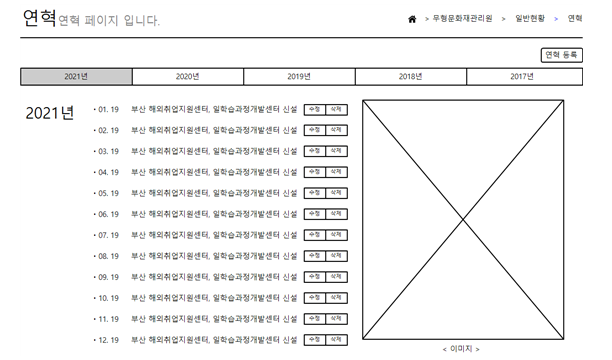
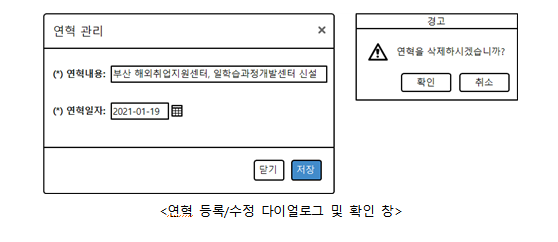
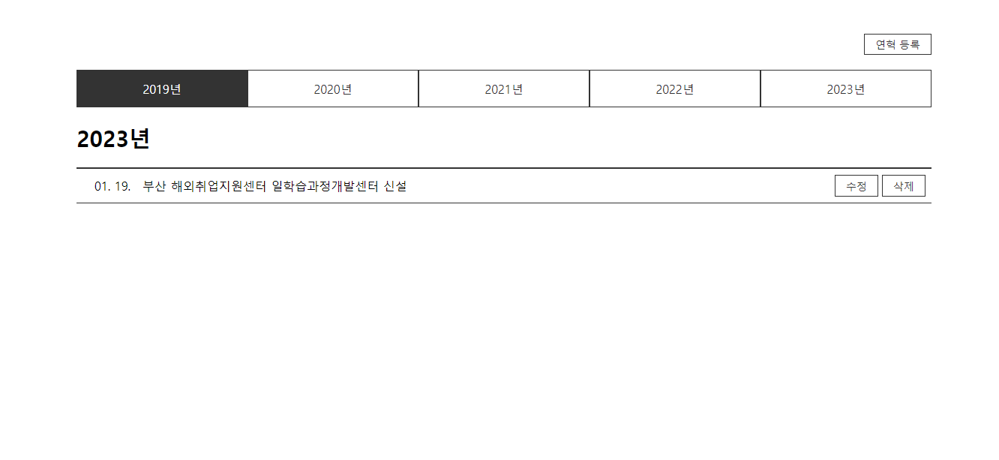
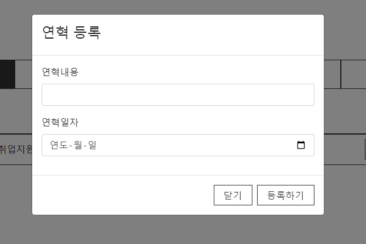

# Javascript Class Guide

---

## 개요

해당 글은 기능경기대회에서 Javascript 과제를 수월하게 해결하기 위한 방법을 이야기 한다.
기능경기대회에서 주요시 되는 JS 능력은 기본적으로 과제를 해결하는 문제해결능력도 중요하지만
B과제 기준 3시간 내에 프론트엔드에서 요구하는 기능을 모두 구현해야하기 때문에
시간적으로 촉박함을 안고 간다는 것에 있다. 따라서 B과제에 필요한 Javascript 능력은 다음과 같다.

1. 최대한 코드를 간단명료하게 작성할 것
2. 코드를 기억하기 쉽게 작성할 것
3. 전체적인 맥락을 정할 것

이를 전체적으로 충족하기 위해서 문제에서 제시한 내용을 객체화하고 class 로 코드를 구성하는 편이 좋다.
class 로 각 요소를 구체화하면 각 class 가 가져야할 동작이나 상태가 생겨나고, 단순한 코드 덩어리가 아니라
하나의 객체로 인식할 수 있게 되어 코드 전체가 기억하기 쉬워지며, 맥락이 생겨나기 때문이다.

따라서 해당 글에서는 2021년 지방기능경기대회 문제를 참고하여 B과제를 class 로 해결하는 방법에 대해 설명한다.

## 연혁 및 연혁 관리

### 개요

2021년 지방대회 과제는 xampp 를 기반으로 서버에서 구동되어 미리 제공되는 php API 파일을 활용해 코드를 구성해야 한다.
해당 B과제에서 xampp 자체에는 별 다른 설정을 하지 않기 때문에 xampp 설치 및 실행과 관련된 이야기는 생략하도록 하겠다.




먼저, 연혁 및 연혁 관리 부분이다. 연혁을 등록하거나 수정 및 삭제할 수 있으며, 브라우저 내에 Storage 기능을 통해
브라우저가 닫혀도 기존에 등록한 내용이 모두 유지되어야 한다. 연혁의 등록과 수정은 모달창을 통해 이루어져야 하며, 삭제는
Confirm 창을 직접 만들어서 삭제 여부를 다시 물어보아야 한다.

```html
<div class="history">
  <div class="header">
    <button class="add">연혁 등록</button>
  </div>
  <div class="tab">
    <div class="tab__item">2019년</div>
    <div class="tab__item">2020년</div>
    <div class="tab__item">2021년</div>
    <div class="tab__item">2022년</div>
    <div class="tab__item">2023년</div>
  </div>
  <div class="content">
    <div>
      <h3>2023년</h3>
      <div class="history-list">
        <div class="history-list__item">
          <div class="date">01. 19.</div>
          <div class="title">부산 해외취업지원센터 일학습과정개발센터 신설</div>
          <div class="button-wrap">
            <button class="btn-edit">수정</button>
            <button class="btn-remove">삭제</button>
          </div>
        </div>
      </div>
    </div>
  </div>
</div>
```

```css
* {
  margin: 0;
  padding: 0;
  box-sizing: border-box;
}

.button-wrap {
  display: flex;
  gap: 5px;
}

button {
  padding: 0.3em 1em;
  border: 1px solid #333;
  color: #333;
  background-color: #fff;
  font-size: 14px;
  cursor: pointer;
}

.history {
  max-width: 1140px;
  margin: 50px auto;
}

.history .header {
  display: flex;
  justify-content: flex-end;
  margin-bottom: 20px;
}

.history .tab {
  display: flex;
  flex-wrap: wrap;
}

.history .tab__item {
  flex: 0 0 20%;
  max-width: 20%;
  width: 100%;
  height: 50px;
  border: 1px solid #333;
  background-color: #fff;
  color: #333;
  text-align: center;
  line-height: 50px;
  cursor: pointer;
}

.history .tab__item.selected {
  background-color: #333;
  color: #fff;
}

.history .content {
  margin-top: 20px;
}

.history h3 {
  font-size: 30px;
  margin-bottom: 20px;
}

.history-list {
  border-top: 2px solid #333;
}

.history-list__item {
  padding: 0.5em;
  display: flex;
  align-items: center;
  border-bottom: 1px solid #333;
}

.history-list .date {
  flex: 0 0 80px;
  text-align: center;
}

.history-list .title {
  flex: 1 0 0;
  overflow: hidden;
  text-overflow: ellipsis;
  white-space: nowrap;
}

.history-list .button-group {
  flex: 0 0 150px;
}
```

먼저 간단하게 HTML 및 CSS 파일을 구성한다. 위 코드를 적용하면 다음과 같은 화면을 얻을 수 있다.



이제 저 화면을 하나의 객체로 만들어 보자. 해당 페이지가 지니고 있어야 하는 것은 무엇일까? 해당 과제에서 페이지로 저장되어야 하는 요소는 다음과 같다.

- 연혁 목록
- 현재 선택한 연도

그럼 이를 class 로 만들어 보면 다음과 같이 만들 수 있다.

```javascript
// HistoryPage.js

class HistoryPage {
  historyList = [];
  selectedYear = null;
}
```

여기서 우리는 저장된 historyList 를 바탕으로 .tab과 .history-list에 DOM을 직접 조작해서 데이터를 반환해주어야 한다. 이를 위해 저장할 변수를 또 만들어 주도록 하자.

```javascript
class HistoryPage {
  // ... (생략)

  listWrapElem = null;
  tabWrapElem = null;
}
```

이렇게 변수가 준비가 완료되었다면, DOM이 load 되면 실행될 초기세팅 메서드를 추가해 보자. 해당 코드는 document 가 ready 되면 실행되어 기본적인 DOM을 저장하고 데이터를 세팅해 주는 역할을 할 것이다.

```javascript
class HistoryPage {
  // ...

  init() {
    this.listWrapElem = document.querySelector('.history-list');
    this.tabWrapElem = document.querySelector('.tab');

  }
}

window.addEventListener('load', () => {
  const app = new HistoryPage();
  app.init();
});
```

이제 기본적인 환경은 구성되었으니, 필요한 내용을 구상해보자.

### 연혁 추가

우선, 데이터가 있어야 보여줄 수 있는 데이터가 생기기 때문에, 연혁 추가와 관련된 작업을 선행해 보겠다. 연혁 추가의 경우 모달 다이얼로그를 추가적으로 생성해서 제작한다. 여기서 문제는 모달을 어떻게 만들 것인가인데, 가장 간단한 방법은 Bootstrap을 사용하는 방법이다.

물론, 모달을 만드는 것이 그렇게 어려운 것은 아니고 만들려면 만들 수는 있지만 최대한 기능경기대회에서는 시간을 단축하는 것이 목표이고, Bootstrap 은 웬만하면 무조건 제공되는 라이브러리이며, 단순히 HTML 에 class 및 data-target / toggle 만 지정해주면 되기 때문에 해당 방법을 채택하게 되었다.
먼저 bootstrap 을 연결해 준다. (2021년도 지방대회에서 제공된 4.5.0 버전을 사용한다.) Bootstrap은 jQuery가 없으면 동작하지 않는 점을 유의하자.

```html
<head>
  <!-- ... -->
  <link rel="stylesheet" href="./assets/bootstrap-4.5.0-dist/css/bootstrap.min.css">
  <script src="./assets/jquery-3.5.1.js"></script>
  <script src="./assets/bootstrap-4.5.0-dist/js/bootstrap.min.js"></script>
</head>
```

그 뒤 HTML 맨 아래에 다음 코드를 추가해 준다.

```html
<form id="insert-form" class="modal fade">
  <div class="modal-dialog">
    <div class="modal-content">
      <div class="modal-header">
        <h4>연혁 등록</h4>
      </div>
      <div class="modal-body">
        <div class="form-group">
          <label>연혁내용</label>
          <input type="text" class="form-control">
        </div>
        <div class="form-group">
          <label>연혁일자</label>
          <input type="date" class="form-control">
        </div>
      </div>
      <div class="modal-footer">
        <button type="button" data-dismiss="modal">닫기</button>
        <button type="submit">등록하기</button>
      </div>
    </div>
  </div>
</form>
```

이렇게 모달에 id를 달아준 뒤, 다른 버튼에서 다음과 같이 속성을 지정해주면 클릭했을 때 자동으로 해달 모달이 열리게 된다.

```html
<button class="add" data-toggle="modal" data-target="#insert-form">연혁 등록</button>
```



Bootstrap 을 사용하면 사용할 일이 많은 input 이나 modal 을 쉽게 대체할 수 있기 때문에 관련된 클래스명만 기억해 두었다가 사용하면 손쉽게 B, C과제에서 디자인이 가능하다.

이제 Javascript 쪽에서 이를 활용해서 데이터를 삽입하는 로직을 만들어 보자.

```javascript
init() {
  // ...

  this.setEvent();
}

setEvent() {
  document.querySelector('#insert-form').addEventListener('submit', (e) => {
    e.preventDefault();

    let title = e.target[0].value;
    let date = e.target[1].value;
    
    this.historyList.push({ title, date });
  });
}
```

Form Element는 자신한테 속한 input과 button을 인덱스로 저장하고 있기 때문에, 순차대로 0, 1로 접근해서 title 과 date를 가져와 historyList에 넣어준다. 이대로면 단순히 historyList 란 변수에다 데이터만 넣은 것이기 때문에, 넣은 데이터를 업데이트 시켜줄 수 있는 메서드를 하나 더 만들어 보겠다.

```javascript
class HistoryPage {
  // ...
  render() {
    // 초기화
    this.listWrapElem.innerHTML = ``;
    // 렌더링
    this.historyList.forEach(historyItem => {
      let date = new Date(historyItem.date);
      let dateText = `${String(date.getMonth() + 1).padStart('0', 2)}. ${String(date.getDate()).padStart('0', 2)}.`;
      let elem = $(`<div class="history-list__item">
        <div class="date">${dateText}</div>
        <div class="title">${historyItem.title}</div>
        <div class="button-wrap">
          <button class="btn-edit">수정</button>
          <button class="btn-remove">삭제</button>
        </div>
      </div>`)[0];
      this.listWrapElem.append(elem);

      $('#insert-form').modal('hide');
    });
  }
}
```

Wrap Element 를 비우고서 현재 저장된 historyList 를 Element 로 연결한다.
jQuery는 CSS Selector 뿐만 아니라 HTML Content 를 입력해도 해당 콘텐츠를 jQuery Object 로 만들어 줄 수 있다. jQuery의 인덱스 0번째는 해당 DOM Element 이기 때문에, 이렇게 접근하여 listWrapElem 에 Element 를 삽입해 준다. Bootstrap 은 jQuery 를 기반으로 하여 modal 메서드를 통해 modal을 닫을 수 있으므로, 해당 명령어를 통해 닫기까지 해주면 렌더링이 완료된다.

이후 setEvent로 다시 돌아와서 render 함수를 실행시켜주게끔 변경해주면 삽입 모달이 열린 뒤 데이터를 입력하면 저장 후 닫히는거까지 완료된다.

```javascript
setEvent() {
  document.querySelector('#insert-form').addEventListener('submit', (e) => {
    // ...
    this.render();
  });
}
```

이제 Storage 를 이용해서 해당 데이터를 브라우저 내에 기록해 보자.
브라우저에서 사용할 수 있는 Storage 로는 Cookies, LocalStorage, IndexedDB가 존재하는데, 이 중 가장 편의성이 좋은 LocalStorage 를 통해 데이터를 저장해 보도록 하겠다.

```javascript
class HistoryPage {
  // ...
  save() {
    localStorage.setItem("historyList", JSON.stringify(this.historyList));
  }

  load() {
    let savedData = localStorage.getItem("historyList");
    if (!savedData) return;
    this.historyList = JSON.parse(savedData);
  }
}
```

간단하게 localStorage를 이용해서 save / load 메서드를 만들었다. localStorage 에는 Object/Array 형태의 데이터가 저장될 수 없기 때문에 JSON.stringify 를 이용해 JSON 문자열로 만들어 준 뒤 저장하고, 나중에 불러올 때엔 JSON.parse 로 데이터를 가져온다.

만든 메서드를 사용해 보도록 하자. setEvent 에서 데이터를 배열에 저장 후 저장까지 시키도록 하고, init 에서는 데이터를 불러온 후, render 함수를 호출해 주자.

```javascript
init() {
  // ...

  this.load();
  this.render();
}

setEvent() {
  document.querySelector("#insert-form").addEventListener("submit", (e) => {
      // ...

      this.save();
    });
}
```

이렇게 하면 데이터가 정상적으로 저장되는 것을 확인할 수 있다.
이제 수정 및 삭제 기능을 만들어 보겠다. 수정 및 삭제는 render 메서드에서 수정/삭제 버튼이 존재하기 때문에 해당 메서드에서 직접 이벤트를 걸어보도록 하겠다.

```javascript

```